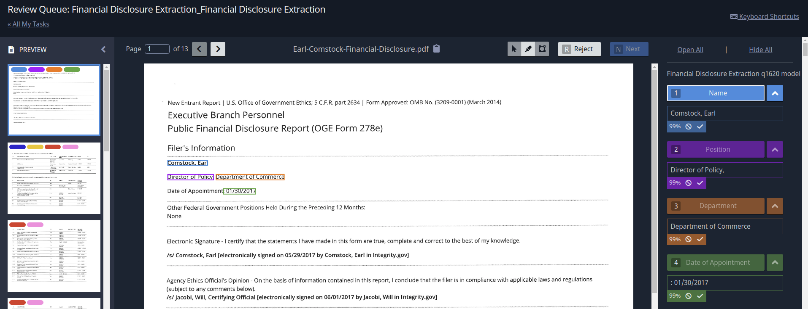
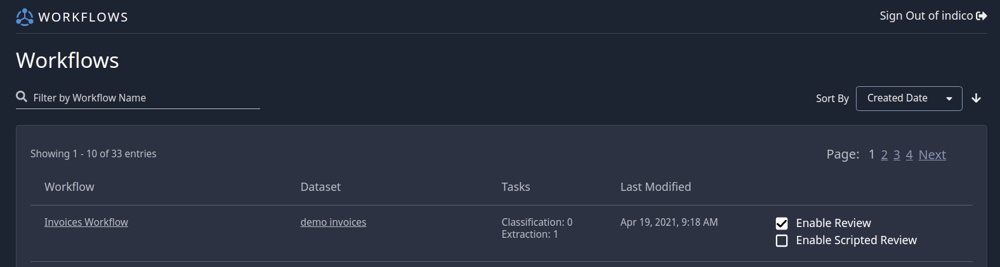

Review
******

Introduction
============

Review provides the option for users to manually check and approve, fix, or reject predictions in the app. 
While the action of reviewing and approving documents must take place in the Application, the API is critical
in the submission of documents for review and for retrieving the results once they've been approved.

Below you can see a sample of what the Review page looks like in the app. The user can reject, edit, or 
approve the model's predictions while viewing the source document. 

Review via the API
======================

Submitting documents to Review requires that you have your workflow ID and have clicked "enable review" for 
that workflow. You can "enable review" by clicking on workflows from your dataset (see image below).

Send a Document for Review::
    
    from indico.queries import WorkflowSubmission

    submissions = client.call(
        WorkflowSubmission(files=["./path/to/sample.pdf"], workflow_id=52, submission=True)
    ) 
    print(submissions[0].id)

WorkflowSubmissions will return a list of Submission objects, each with a unique identifier and job id. 
In the background, the documents are OCR'd (when applicable) and been passed to workflow's models. Once
it has been passed through the applicable models, it will be ready for manual review on the Review page 
in the app.

The call below finds documents that have finished being reviewed, gets the results, 
and marks the result as having been retrieved::

    from indico.queries import GenerateSubmissionResult, ListSubmissions
    from indico.filters import SubmissionFilter

    # creates a list of type Submission objects, with attributes like ‘input_file’ and ‘workflow_id’ 
    submissions = client.call(ListSubmissions(workflow_ids=[52], filters=SubmissionFilter(status="COMPLETE")))
    # Generate the result for the first completed submission
    job = client.call(GenerateSubmissionResult(submissions[0].id))
    result_url = client.call(JobStatus(id=job.id, wait=True))
    result = client.call(RetrieveStorageObject(result_url.result))
    # Finally, mark the submission as retrieved
    client.call(UpdateSubmission(submissions[0].id, retrieved=True))

This is what a sample of what the "result" object in the snippet above might look like::

    # Rejected document
    {'submission_id': 155,
    'etl_output': 'indico-file:///storage/submission/28/155/155_etl_output.json',
    'errors': [],
    'results': {
        'document': {
            'results': {'My Model name': {
                'pre_review': [{'start': 0,
                            'end': 34,
                            'label': 'Name',
                            'text': 'John Smith',
                            'confidence': {
                            'Name': 0.99,
                            'Address': 0.0001}}],
                'final': [{'start': 0,
                            'end': 34,
                            'label': 'Name',
                            'text': 'James Smith',
                            'confidence': {
                            'Name': 0.99,
                            'Address': 0.0001}}],
        }}}},
    'review_id': 40,
    'reviewer_id': 24,
    'review_notes': 'Made one change and approved',
    'review_rejected': False,
    'admin_review': True}

This example has been approved with a fix by the manual user in the 'final' results, notice that 
the 'text' field has changed from 'John Smith' to 'James Smith'. If the document is rejected in Review,
"review_rejected" will equal True and 'final' will equal None. 