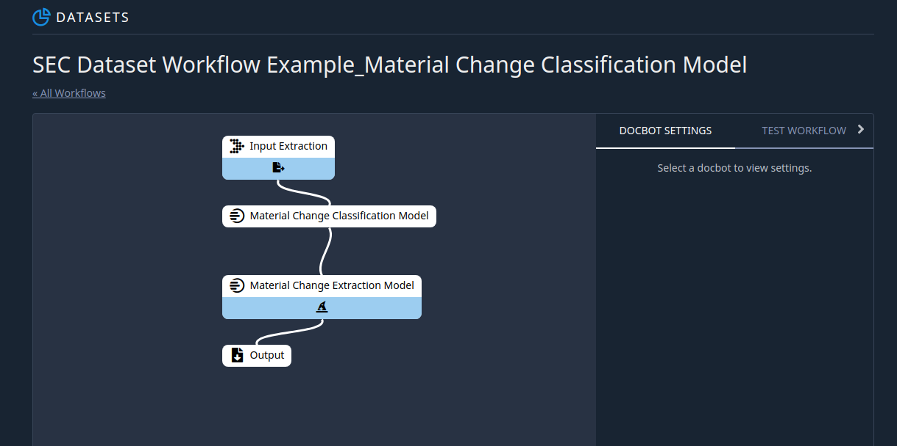

Workflows
*********

Introduction
============

The Indico Platform includes the ability to link several models and operations together into a unified Workflow. 
Here's an example of what a Workflow with three linked models looks like on the Indico Platform:

In this case, we are linking OCR to a classification model to two extraction models
to a human-in-the-loop Review process before arriving at a final output. The input to this Workflow is an unknown Financial 
Disclosure or Invoice document, which is then classified (as one of those two types), passed to an extraction model where data
specific to the document type is retrieved, sent to a Review step where a human will validate the classification and 
extraction model predictions, and finally output as a JSON where it can be processed into your organization's systems. 

Using the Indico API, your organization has flexibility to customize the processes described above. For example, 
you can set up push notifications to alert you when a document has received its predictions and/or when it has been human reviewed.
You can also apply custom functions to model output prior to human review to standardize fields and/or automatically accept certain predictions 
without a human-in-the-loop review (note: you should be very cautious in the types of predictions you auto-accept). 

A Workflow is automatically created whenever you train a new model. Information about your Workflows can be found through
the dataset page, where you can also enable human-in-the-loop Review. For more details on creating Workflows, `see this article <https://indicodata.zendesk.com/hc/en-us/articles/360045464112-Creating-Administering-a-Workflow>`_.
With Workflows, you can encapsulate multiple model calls and processing steps into one API call and easily integrate Indico 
into your systems.

Running Workflows via API
=========================

To begin using the API with your Workflow, first you will want to find the Workflow ID. On the workflows page,
click on the name of your Workflow. In the URL, find the number that appears after 'workflows'. For example, in the URL
below the Workflow ID is '1000'::

    https://app.indico.io/workflows/1000/canvas

Alternatively, you can use the ListWorkflows API call along with the dataset ID (7589 in the URL below) to identify all of
the workflows associated with a given dataset::

    https://app.indico.io/datasets/7589/files

The following snippet demonstrates how to submit a document to a Workflow::

    from indico.queries import WorkflowSubmission

    submissions = client.call(
        WorkflowSubmission(files=["./path/to/sample.pdf"], workflow_id=1000)
    )

In the above snippet, we passed a single PDF file to a Workflow, but we could have just as easilly passed multiple files.
Submitted documents are processed asynchronously within the Indico platform and each is assigned a unique and persistent
submission ID. The "submissions" variable above will be a list of integers (length equal to the number of documents submitted) 
where each integer represents a unique and persistent submission ID per document (the order of the IDs maps to the 
order of documents in the list passed to the files kwarg).

You can then use these IDs to track the status of individual submissions like::

    from indico.queries import WorkflowSubmission

    submission = client.call(GetSubmission(8231))
    print(submission.status, submission.input_filename, submission.retrieved, submission.id)

GetSubmission returns a Submission object containing useful information about the submission (including whether
it has been processed, reviewed, and/or retrieved).

If the submission has been processed, you can retrieve the json result for a submission like:: 

    from indico.queries import SubmissionResult, RetrieveStorageObject

    job = client.call(SubmissionResult(8231, wait=True))
    result = client.call(RetrieveStorageObject(job.result))

See the :doc:`review-intro` section for more details on working with Workflows, including how to query for multiple submissions
to a workflow, what different submissions statuses mean, and how to mark a submission as retrieved.